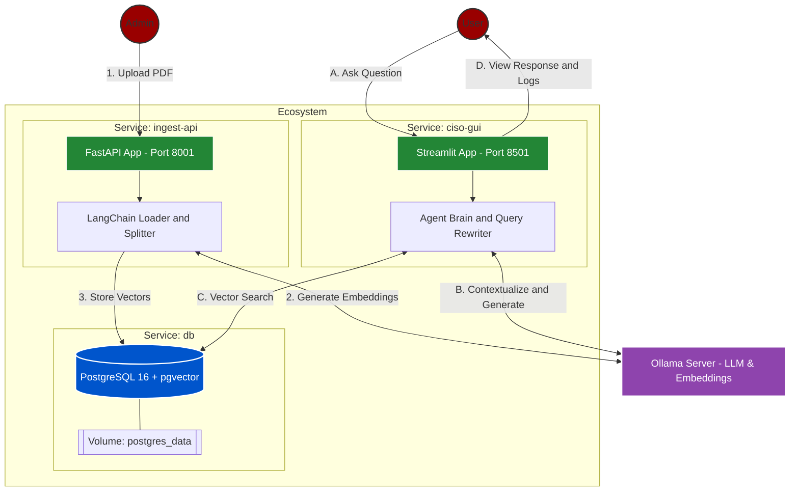

# 🛡️ POC - Local RAG Infrastructure

This is a Proof of Concept (POC) for an AI Security Specialist.

This agent is configured in a containerized environment, using **Ollama** for LLM processing and **PostgreSQL** as a vector brain.

## 🚀 The Architecture: "The Heavy Lifter"
The ecosystem:
*   **Brain:** Llama 3 (via Ollama) running locally.
*   **Memory:** PostgreSQL with `pgvector` extension for high-speed semantic search.
*   **Ingestion:** A dedicated FastAPI service to shred, embed, and store PDFs into the vector database.
*   **Agent Logic:** A RAG (Retrieval-Augmented Generation) chain with Query Rewriting (it understands context, not just keywords).
*   **Infrastructure:** Fully Dockerized. One command to rule them all.

## 🛠️ Tech Stack
*   **Language:** Python 3.12 (managed by `uv` for blazing-fast dependency resolution).
*   **LLM/Embeddings:** Ollama (`llama3` & `mxbai-embed-large`).
*   **Database:** PostgreSQL 16 + `pgvector`.
*   **Orchestration:** Docker Compose.
*   **API:** FastAPI.
*   **GUI:** Streamlit.

## 🏁 Getting Started (Local Setup)

### 1. Prerequisites
*   Docker installed.
*   Ollama installed and running on your host machine.
*   Pull the models:
    ```bash
    ollama pull llama3
    ollama pull mxbai-embed-large
    ```

### 2. Environment Variables
Create a `.env` file in the root directory:
```env
PG_HOST=db
PG_PORT=your_port
PG_DB=your_db
PG_USER=your_admin
PG_PASSWORD=your_secure_password

OLLAMA_BASE_URL=your_ollama_host_url
COLLECTION_NAME=your_collection_name
```

### 3. Spin Up the Engine
Run the magic command:
```bash
docker compose up --build
```

## 📖 How to Use

### Step 1: Ingesting Data
Send your security policies, OWASP docs, or compliance PDFs to the Ingestor:
```bash
curl -X POST "http://localhost:8001/ingest" -F "file=@./your-document.pdf"
```

*Note*: The API will shred the PDF, generate embeddings, and store them in the PostgreSQL vector brain.

### Step 2: Chatting with the Agent
Open your browser and navigate to the Interactive Web GUI:
* URL: http://localhost:8501

#### Features available in the GUI:
* 💬 **Real-time Chat**: Ask questions about the ingested security documents.
* 📚 **Source Transparency**: View exactly which document chunks were used to generate each answer.

## 🛡️ Why This Matters
*   **No Hallucinations:** The agent is grounded in the documents you provide. If it's not in the DB, it won't invent it.
*   **Cost Efficient:** Zero API costs. It runs on your hardware (Optimized for Apple Silicon/M4).

## 🏗️ System Architecture
The project follows a decoupled RAG (Retrieval-Augmented Generation) architecture, separating data ingestion from the conversational agent.

### High-Level Flow Diagram

    
## 🏗️ Roadmap
- [x] **Persistent Vector Storage**: PostgreSQL with pgvector for high-performance retrieval.
- [x] **Containerized Microservices**: Fully dockerized environment for easy deployment.
- [x] **Interactive Web GUI**: Streamlit dashboard with real-time retrieval logs.
- [ ] **Session Management**: Persistent chat history and user context.
- [ ] **Service Decoupling**: Independent scaling for Embedding and LLM engines.
- [ ] **Advanced RAG**: Implementation of Re-ranking and Query Expansion for higher precision.
- [ ] **Observability & Evaluation**: Automated metrics to measure faithfulness and relevancy.
- [ ] **Enterprise Security**: JWT Authentication and Role-Based Access Control (RBAC).
    
---
Alive and kicking! 👊 hehehehe